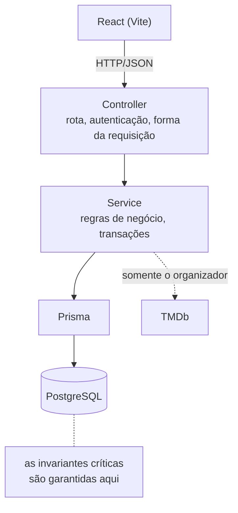
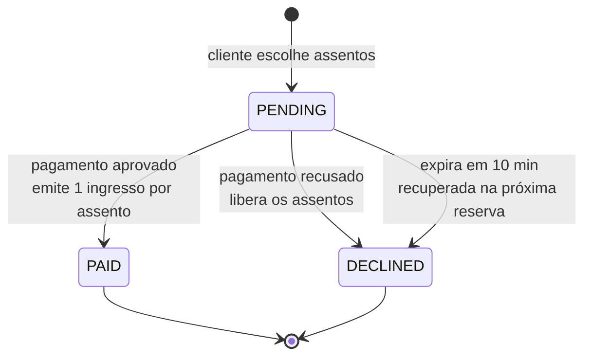
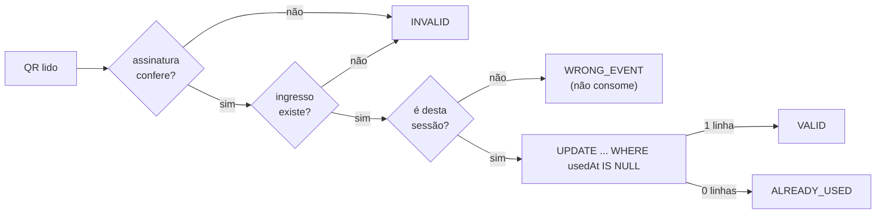

# Elite Ticketing

Plataforma de eventos e ingressos construída para o Desafio Elite Dev 2026.

Um organizador monta uma sessão de cinema a partir do catálogo do TMDb, define
sala, horário, mapa de assentos e preço. O cliente navega pelos eventos
publicados, escolhe a poltrona, paga de forma simulada e recebe um ingresso com
QR assinado que pode compartilhar por link. Na entrada, a portaria valida o QR
pela câmera.

## Avalie em 5 minutos

> **Aplicação publicada:** _<preencher após o deploy>_
> **Repositório:** https://github.com/Digao075/elite-ticketing

Todos os usuários abaixo usam a senha `Elite@2026`:

| Papel | E-mail |
|---|---|
| Cliente | `cliente1@elite.test` |
| Organizador | `organizador@elite.test` |
| Portaria | `portaria@elite.test` |

O caminho abaixo percorre o fluxo inteiro e demonstra as duas invariantes que o
enunciado pede — assento não vendido duas vezes e ingresso não validado duas
vezes:

1. Abra a home: a sessão **Clube da Luta** aparece com preço e lugares livres.
2. Entre nela e escolha **dois assentos** no mapa.
3. Entre como **cliente** e reserve.
4. No checkout, use **"Simular pagamento recusado"** primeiro. Volte ao evento:
   **os assentos voltaram para o estoque.**
5. Reserve de novo e agora **aprove**. Em *Meus ingressos* o QR é exibido.
6. Saia, entre como **portaria**, cole o código `v1.…` e valide: **`VALID`**.
   Valide o mesmo código outra vez: **`ALREADY_USED`**.

O passo 6, repetido, é a demonstração mais curta de que o uso único é garantido
pelo banco e não pela interface.

Rodando localmente, [os comandos estão abaixo](#rodando-localmente). Se algo
parecer fora do lugar, as [limitações conhecidas](#limitações-conhecidas) estão
declaradas — nada foi omitido em silêncio.

## Estado atual

O fluxo de ponta a ponta está implementado e coberto por testes de integração
contra um PostgreSQL real. O que ainda não está pronto está listado em
[Limitações conhecidas](#limitações-conhecidas) — nada foi omitido de propósito
sem aviso.

## Funcionalidades

**Organizador**

- Busca e descoberta de filmes no TMDb, com detalhe canônico do título escolhido
- Criação de evento idempotente (`Idempotency-Key`), com trava de sala e horário
- Configuração atômica do mapa de assentos e do preço, com capacidade derivada
- Publicação do evento, exigindo preço e ao menos um assento
- Painel com as próprias sessões: status, ingressos vendidos, lugares livres e
  receita, publicando direto da lista quando o rascunho já está pronto

**Cliente**

- Navegação pelos eventos publicados, sem necessidade de login
- Mapa de assentos com disponibilidade em tempo de requisição
- Reserva com espera de 10 minutos
- Pagamento simulado, contemplando **aprovação e recusa**
- Área "Meus ingressos" com QR
- Compartilhamento do ingresso por link não adivinhável

**Portaria**

- Leitura do QR pela câmera, com digitação manual como alternativa
- Retorno explícito: `VALID`, `INVALID`, `ALREADY_USED` ou `WRONG_EVENT`

## Stack

| Camada | Escolha |
|---|---|
| Front-end | React 19, TypeScript, Vite, Tailwind CSS |
| Back-end | NestJS 11, TypeScript, REST |
| Banco | PostgreSQL 16 via Prisma |
| Testes | Vitest, Supertest, Testing Library |
| Infra local | Docker Compose |

## Arquitetura



Monólito modular. Cada módulo (`auth`, `catalog`, `events`, `seats`,
`discovery`, `reservations`, `tickets`, `gate`) é dono dos próprios endpoints,
regras e DTOs. O TMDb é acessado **somente** pelo back-end, e o evento guarda um
snapshot do conteúdo no momento da criação — telas públicas nunca dependem de
uma chamada externa ao vivo.

### Ciclo de vida de uma reserva



O assento é ocupado por uma linha em `SeatAllocation`. Liberar marca
`releasedAt` em vez de apagar: um índice único **parcial**
(`WHERE "releasedAt" IS NULL`) garante que exista no máximo uma alocação viva
por assento, então a segunda venda simultânea é recusada pelo PostgreSQL — e a
tentativa continua auditável.

### Validação na portaria



A checagem de sessão vem **antes** do `UPDATE`: apresentar o ingresso na porta
errada não pode queimá-lo, ou o portador seria recusado na porta certa.

Detalhes em [docs/architecture.md](docs/architecture.md) e nos
[ADRs](docs/adr).

## Rodando localmente

Pré-requisitos: Node.js 22+, pnpm 11+ e Docker Desktop em execução.

```bash
cp .env.example .env      # no Windows: Copy-Item .env.example .env
pnpm install
pnpm db:up                # sobe o PostgreSQL
pnpm db:migrate           # aplica as migrations
pnpm db:seed              # dados de demonstração
pnpm dev                  # API em :3000, web em :5173
```

`TMDB_API_KEY` precisa ter **algum** valor para a API subir — a validação de
configuração é intencionalmente fail-fast, para o serviço não iniciar num estado
meio configurado. O `.env.example` já traz um placeholder, então
`cp .env.example .env` basta para rodar.

Para usar a **busca de filmes do organizador** você precisa de uma chave real e
gratuita do [TMDb](https://developer.themoviedb.org/docs). Sem ela, só a busca
falha (com erro tratado); descoberta, reserva, pagamento, ingresso e portaria
funcionam normalmente, porque o evento guarda o snapshot do conteúdo — e o seed
já cria uma sessão publicada.

### Usuários semeados

Todos usam a senha `Elite@2026`:

| Papel | E-mail |
|---|---|
| Organizador | `organizador@elite.test` |
| Cliente | `cliente1@elite.test` |
| Cliente | `cliente2@elite.test` |
| Portaria | `portaria@elite.test` |

O seed também cria o evento **"Clube da Luta"** publicado, com 24 assentos a
R$ 35,00. É idempotente: rodar de novo converge para o mesmo estado.

## Variáveis de ambiente

| Variável | Para quê |
|---|---|
| `DATABASE_URL` | Conexão PostgreSQL |
| `POSTGRES_PORT` | Porta publicada pelo container |
| `API_PORT` | Porta da API |
| `VITE_API_URL` | Base da API para o front-end |
| `TMDB_API_KEY` | Catálogo de filmes (só o organizador precisa) |
| `AUTH_JWT_SECRET` | Assina os tokens de acesso |
| `CONTENT_SELECTION_SECRET` | Assina a seleção de conteúdo do organizador |
| `TICKET_QR_SECRET` | Assina o QR do ingresso |

Nenhum segredo real está versionado. `.env.example` traz apenas placeholders.

## Testes

```bash
pnpm test        # typecheck + suíte completa em um PostgreSQL descartável
pnpm build       # compila API e web
```

`pnpm test` sobe um banco `db-test` isolado, aplica as migrations, roda tudo e
derruba o container ao final. Ele **se recusa** a rodar contra qualquer
`DATABASE_URL` que não seja o banco de teste dedicado — proteção contra apontar
a suíte para dados reais sem querer.

O comando roda `tsc` antes dos testes de propósito: o Vitest transpila sem
checar tipos, então uma build quebrada passava despercebida por uma suíte verde.

### Integração contínua

Todo push em `main` e todo pull request rodam
[`.github/workflows/ci.yml`](.github/workflows/ci.yml): instalação com lockfile
congelado, `tsc`, a suíte completa contra um PostgreSQL descartável e o build
das duas aplicações.

O passo de teste é **exatamente o mesmo `pnpm test` que se roda localmente** —
não uma variação adaptada ao CI. Quando a esteira fica verde, ela afirma a mesma
coisa que a máquina do desenvolvedor afirma.

A suíte é hermética: nenhum segredo é necessário, porque o runner injeta valores
de teste inertes e toda chamada externa é dublada.

Não há linter configurado, então não há passo de lint. Isso está registrado como
lacuna real em [Melhorias futuras](#melhorias-futuras) em vez de disfarçado.

### Verificando as invariantes

As duas garantias centrais são provadas com requisições realmente concorrentes,
não com mocks. Para conferir só elas:

```bash
pnpm --dir apps/api exec vitest run ../../tests/api/journey
```

| O que prova | Teste |
|---|---|
| Um assento nunca é vendido duas vezes | `AC-3 never sells one seat twice and reclaims expired holds` |
| Um ingresso nunca é validado duas vezes | `AC-6 concurrent scans of one unused ticket yield a single VALID` |
| QR forjado ou adulterado é recusado | `AC-5 and AC-6 reject forged QR codes and consume a ticket exactly once` |

Do lado da interface, `tests/web/journey.test.tsx` cobre o outro lado da mesma
invariante: quando a API responde `409` porque alguém levou o assento primeiro,
o mapa relê a disponibilidade em vez de continuar exibindo um lugar que não
existe mais.

## API

| Método | Rota | Papel | O que faz |
|---|---|---|---|
| `POST` | `/auth/login` | público | Token de acesso |
| `GET` | `/catalog/movies` | organizador | Busca no TMDb |
| `GET` | `/catalog/movies/popular` | organizador | Descoberta |
| `GET` | `/catalog/movies/:id` | organizador | Detalhe canônico |
| `POST` | `/events` | organizador | Cria rascunho (idempotente) |
| `GET` | `/events/:id` | organizador | Evento próprio |
| `PUT` | `/events/:id/seats` | organizador | Assentos e preço |
| `POST` | `/events/:id/publish` | organizador | Publica |
| `GET` | `/organizer/events` | organizador | Painel: sessões próprias com vendas |
| `GET` | `/events` | **público** | Eventos publicados |
| `GET` | `/events/:id/public` | **público** | Detalhe com disponibilidade |
| `POST` | `/reservations` | cliente | Reserva assentos |
| `POST` | `/reservations/:id/payment` | cliente | Pagamento simulado |
| `GET` | `/tickets/me` | cliente | Meus ingressos |
| `GET` | `/tickets/shared/:token` | **público** | Ingresso compartilhado |
| `POST` | `/gate/validations` | portaria | Valida o QR |

## Deploy

A aplicação roda em três serviços gerenciados: banco no **Neon**, API no
**Render** e front-end na **Vercel**.

### Banco (Neon)

Use a string de conexão **direta**, não a `-pooler`: as migrations do Prisma não
funcionam sobre o pooler. Acrescente `?sslmode=require`.

### API (Render)

```text
Build:        pnpm install --frozen-lockfile
              && pnpm --filter @elite-ticketing/api exec prisma generate
              && pnpm --filter @elite-ticketing/api build
Start:        node apps/api/dist/main
Pre-deploy:   pnpm db:migrate && pnpm db:seed
```

Variáveis: `DATABASE_URL`, `TMDB_API_KEY`, `AUTH_JWT_SECRET`,
`TICKET_QR_SECRET`, `CONTENT_SELECTION_SECRET` e `WEB_ORIGIN` apontando para o
domínio da Vercel. `WEB_ORIGIN` precisa bater exatamente, senão o navegador
bloqueia toda requisição por CORS.

A aplicação escuta `PORT` quando a plataforma injeta essa variável, e cai para
`API_PORT` no ambiente local.

### Front-end (Vercel)

```text
Root Directory:   apps/web
Install:          cd ../.. && pnpm install --frozen-lockfile
Build:            pnpm build
Output:           dist
```

Variável: `VITE_API_URL` com a URL da API no Render.

O `apps/web/vercel.json` reescreve qualquer rota sem arquivo estático
correspondente para `index.html`. Sem isso o roteamento client-side quebra ao
abrir um link direto — e o **ingresso compartilhado é sempre aberto assim**.

### Sobre o ambiente publicado

O plano gratuito do Render hiberna após alguns minutos sem tráfego, então a
**primeira requisição pode levar cerca de 50 segundos**. Não está quebrado, está
acordando.

O ambiente publicado é uma demonstração: roda com os usuários semeados e senha
conhecida, documentados acima, justamente para permitir a avaliação.

## Decisões de engenharia

**As duas invariantes críticas vivem no PostgreSQL, não no código.**
Verificar-e-depois-gravar tem uma janela de corrida que nenhum cuidado fecha.
Um assento nunca é vendido duas vezes porque existe um índice único parcial em
`SeatAllocation("eventSeatId") WHERE "releasedAt" IS NULL` — o banco recusa a
segunda venda. Um ingresso nunca é validado duas vezes porque a portaria roda
`UPDATE "Ticket" SET "usedAt" = now() WHERE id = $1 AND "usedAt" IS NULL`: a
segunda leitura simultânea afeta zero linhas. Ambos os casos são provados por
requisições realmente concorrentes na suíte.

**Liberar assento marca `releasedAt` em vez de apagar a linha.** O índice
parcial libera o assento e a tentativa continua auditável.

**Reservas expiram preguiçosamente.** O único momento em que uma reserva velha
importa é quando alguém quer aquele assento, então ela é recuperada dentro da
própria transação de reserva. Sem agendador, sem processo de fundo.

**O QR é `v1.<ticketId>.<HMAC-SHA256>`.** Só o id trafega em claro; a assinatura
prova a origem e é conferida em tempo constante. Nada secreto é guardado junto
do ingresso, então quem lê o banco ainda não consegue forjar um código, e o
ingresso pode ser renderizado de novo sem armazenar credencial.

**Porta errada não queima o ingresso.** `WRONG_EVENT` é checado antes do
`UPDATE`, então apresentar o ingresso na sala errada não o consome.

**Capacidade é derivada, nunca armazenada.** Um número editável diverge do
estoque real; capacidade é sempre a contagem de `EventSeat`.

**Preço em centavos inteiros.** Ponto flutuante não pertence a dinheiro.

**Evento guarda snapshot do TMDb.** A vitrine não pode depender da
disponibilidade de um terceiro.

## Processo

O projeto foi construído por incrementos pequenos: contrato escrito antes do
código, testes antes da implementação, revisão independente e uma decisão minha
registrada antes de seguir. Foram 14 contratos de tarefa, 93 decisões e 11
revisões ao longo do desafio.

O relato completo — incluindo **as alternativas descartadas e o erro mais
instrutivo do projeto** — está em [docs/PROCESS.md](docs/PROCESS.md).

O uso de IA, com os pontos em que ela errou, está em
[docs/AI_USAGE.md](docs/AI_USAGE.md).

## Limitações conhecidas

- **Sem recuperação de senha e sem cadastro pela interface.** Usuários vêm do
  seed. Estava fora do escopo pedido.
- **Pagamento é simulado.** `approve` e `decline` são escolhidos no checkout;
  não há provedor real, conforme o enunciado permite.
- **Busca e filtro de eventos não foram implementados.** Constam como opcionais
  no enunciado e foram cortados conscientemente para garantir o fluxo completo
  dentro do prazo.
- **Mapa de assentos não é tempo real.** A disponibilidade é lida a cada
  requisição; não há WebSocket. Duas pessoas podem ver o mesmo assento livre —
  o banco recusa a segunda reserva, e a interface mostra o erro.
- **A câmera exige contexto seguro.** Navegadores só liberam a câmera em
  `https` ou `localhost`. Em `http` num IP de rede, use a digitação manual.
- **Sem paginação.** A lista de eventos é pequena por natureza aqui.

## Melhorias futuras

Deixadas de fora conscientemente: busca e filtro, cancelamento com devolução ao
estoque, assentos em tempo real por WebSocket, e-mail de confirmação, e
observabilidade.
